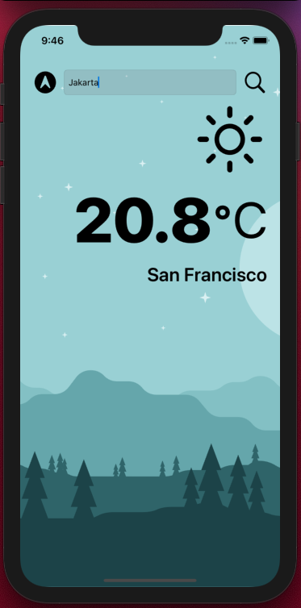

# Clima
UIKit web application for iPhone. Search city and receive API callback with weather data.

This was a tutorial I followed with it's own in-built challenges. I enjoyed working them out and completing this app. I had been keen to learn more about working with URL's and networking, so this fitted the bill perfectly.

## To Run App - 

1. Hit the green 'Code' button on this repo and copy the link to clone project
2. Load up xcode.
3. Under Source Control, click 'Clone'
4. Paste link into window and click 'Clone'
5. Navigate to where project is to be saved
6. Once opened, Run project and enjoy!

### UI Design

